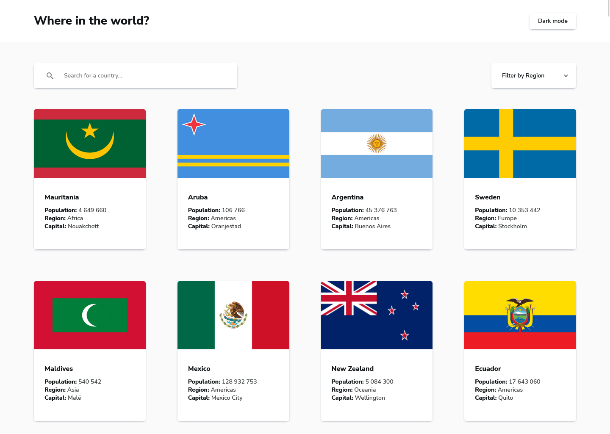

# Frontend Mentor - REST Countries API with color theme switcher solution

This is a solution to the [REST Countries API with color theme switcher challenge on Frontend Mentor](https://www.frontendmentor.io/challenges/rest-countries-api-with-color-theme-switcher-5cacc469fec04111f7b848ca). Frontend Mentor challenges help you improve your coding skills by building realistic projects.

## Table of contents

- [Overview](#overview)
  - [Screenshot](#screenshot)
  - [Links](#links)
- [My process](#my-process)
  - [Built with](#built-with)
  - [What I learned](#what-i-learned)
- [Author](#author)

## Overview

### Screenshot

### Links

- Live Site URL: [Frontend Mentor REST Countries API with color theme switcher](https://pawel-gnat.github.io/Frontend-Mentor-REST-Countries-API/)

## My process

I followed a [Jak zaczac programowac](https://www.youtube.com/@JZP) tutorial to help myself with JavaScript logic. Media queries and theme switcher is what I added later.

### Built with

- Semantic HTML5 markup
- CSS custom properties
- Flexbox
- Grid
- JavaScript

### What I learned

I tried desktop-first approach and I didn't like it. I find it as a bad way to code. Managing media queries later is a bit of mess. I learned how to use routing with `window.location.search`. I also tried other approach of creating html elements by JS (here, I created each element by separate function and I nested it later into one component).

I needed 10,5 hours to completed this app. I really enjoyed this challenge and it was my first work with such a big API. I didn't focus so much on CSS styling here.

## Author

- Frontend Mentor - [@Pawel-Gnat](https://www.frontendmentor.io/profile/Pawel-Gnat)
